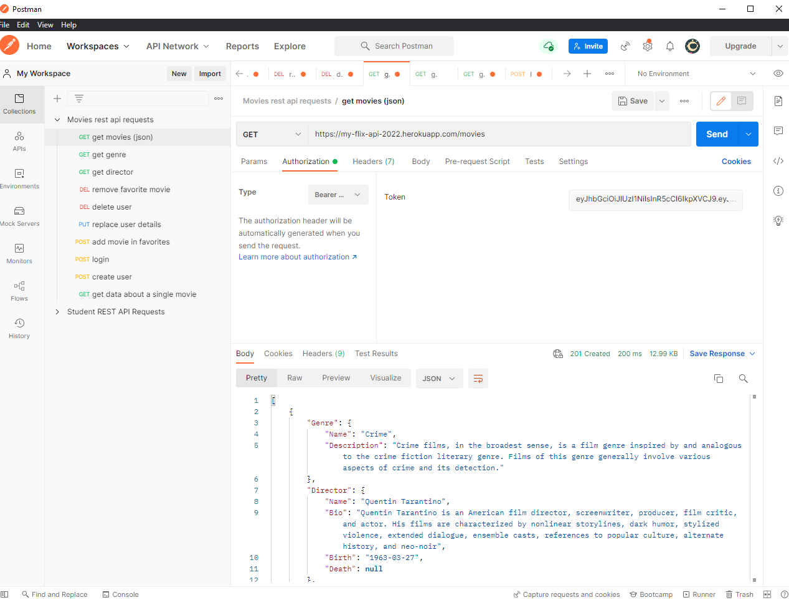
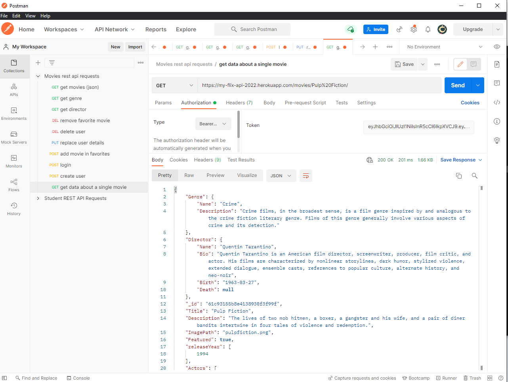
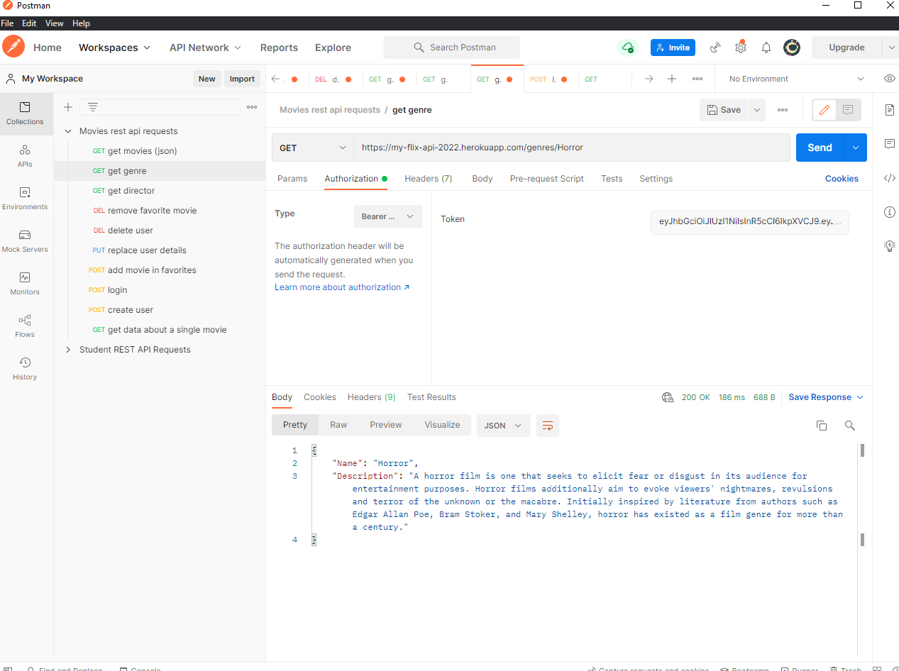
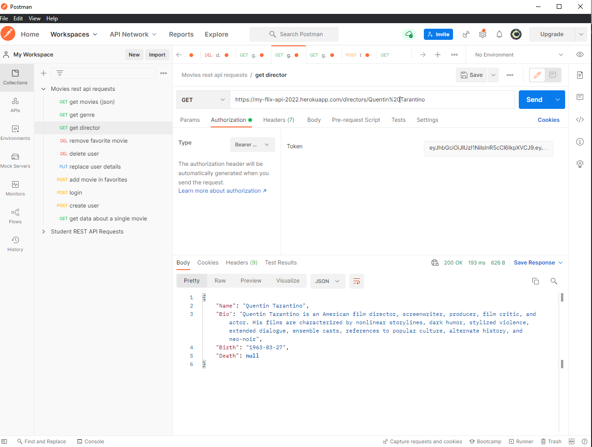
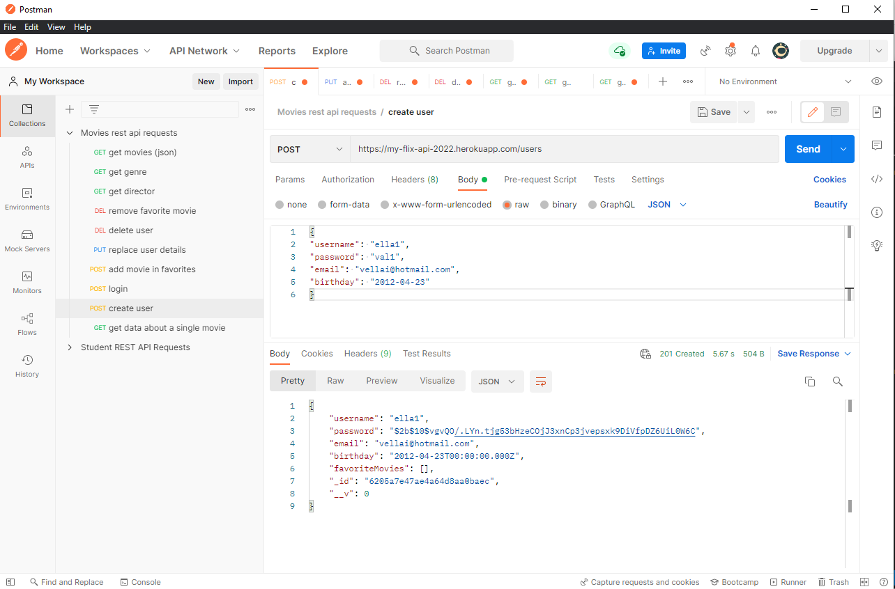
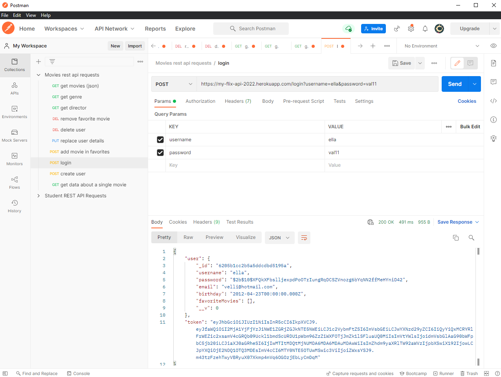
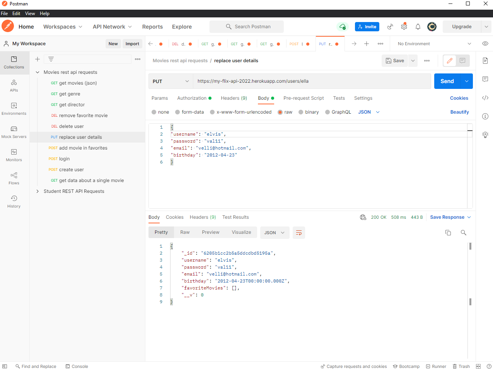
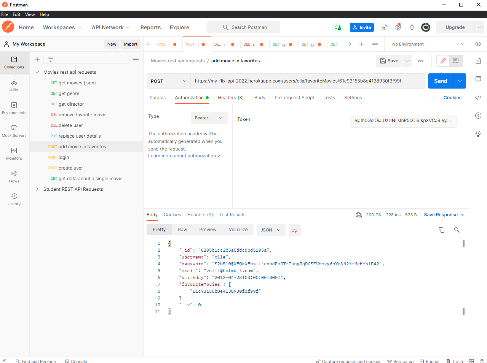
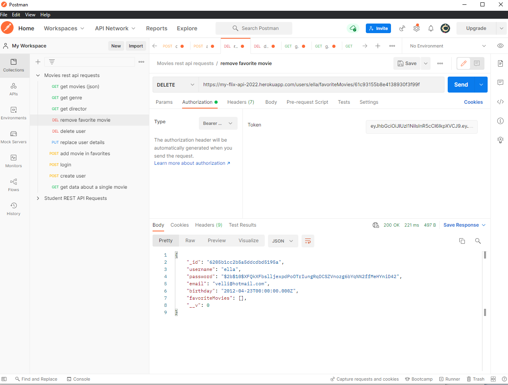
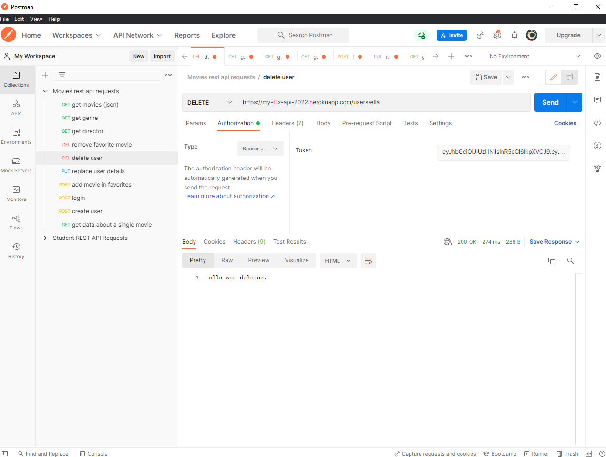

# My flix - movie API 

## Description
MyFlix (movie_api) is a server-side component (REST API) of a “movies” web application. The web application provides users with access to information about different
movies, directors, and genres. Users are able to sign up, update their personal information, and create a list of their favorite movies.

## A live preview of the app can be accessed [here](https://valentina-my-flix-client.netlify.app/)

## Deployment
The API is deployed to Heroku at [this link](https://my-flix-api-2022.herokuapp.com/)

## Documentation
Open [this link](https://my-flix-api-2022.herokuapp.com/documentation.html) to see a documentation of the endpoints

## User Stories
- As a user, I want to be able to receive information on movies, directors, and genres so that I can learn more about movies I’ve watched or am interested in.
- As a user, I want to be able to create a profile so I can save data about my favorite movies.

## Features (screenshots from Postman)
- Return a list of ALL movies to the user
 

- Return data (description, genre, director, image URL, whether it’s featured or not) about a single movie by title to the user
 

- Return data about a genre (description) by name/title (e.g., “Thriller”)
 

- Return data about a director (bio, birth year, death year) by name
 

- Allow new users to register

- Allow users to login
 

- Allow users to update their user info (username, password, email, date of birth)
 

- Allow users to add a movie to their list of favorites
 

- Allow users to remove a movie from their list of favorites

- Allow existing users to deregister
 

## Technologies
- Node.js
- Postman (testing)
- MongoDb (database)
- Mongoose (business logic)
- CORS (Cross-Origin Resource Sharing, used to allow or disallow cross domain requests to the API)

## Frameworks
- Express

## Middleware libraries
- Morgan - to log requests data
- Body-Parser - to read the body of the http requests 
- Passport - for authentication 
- Bcrypt - to allow password hashing 
- Express validator - to prevent cross-site scripting attacks 

## Setting up the development environment
- make sure the latest version of Node is installed via nvm 
- Creating a Default “package.json” File
>npm init -y
- Installing Express as global dependency
>npm install --global express-generator
- Installing Morgan (local dependency)
>npm install morgan --save
- Make sure that the latest version of MongoDB is installed, as well as MongoDB database tools. Add the path to the MongoDB Database Tools to the Path system environment variables
- Insalling Mongoose
>npm install mongoose 
- Installing Passport and its relative libraries for the authentication methods needed for the application (JWT token)
>npm install --save passport passport-local passport-jwt jsonwebtoken
- Installing the CORS module
>npm install cors
- Installing Bcrypt
>npm install bcrypt
- To install Express validator
>npm install express-validator

## Launch
- To start the server
>npm run start

## Mongo shell
- To launch the Mongo shell
>mongo
- To quit the Mongo shell
>quit()
- To see a list of all databases: 
>show dbs
- To either create a new database or switch to a different database:
>use [database name]
- To view all of the collections in your current database:
>db.getCollectionNames()
- To create a new collection:
>db.createCollection("collectionName")
- To insert a new document into a collection (add at the end of the document)
>db.collectionName.insertOne(document-to-insert)
- To read all records from a certain collection:
>db.[collectionName].find()
- To read the first record in a collection:
>db.[collectionName].findOne()
- To read with conditions
>db.[collectionName].find( [Condition] )
>db.[collectionName].findOne( [Condition] )
- To update (or change) information within a document:
>db.[Collection Name].update( {[Condition for which records to update]}, {$set[Update to make]} )
- To add something entirely new to a collection:
>db.[collectionName].update( [condition of which items to update],
    { $push: { name of key to add value to end of array] : [value to add to end of array ] } })
- To delete all the records from a collection that meet a certain condition:
>db.[collectionName].deleteOne([condition])
>db.[collectionName].deleteMany([condition])

## Hosting with Heroku
- Sign up for a free Heroku account.
- Install the Heroku Toolbelt
- Update the “package.json” file to include “start” script
>"start": "node index.js"
- Update the app.listen(); function in the “index.js” file. 
>const port = process.env.PORT || 8080;
app.listen(port, '0.0.0.0',() => {
 console.log('Listening on Port ' + port);
});
- commit/push the changes to your GitHub. Then, in the terminal on your project folder, create an app on Heroku:
>heroku create
- Send your application to Heroku 
>git push heroku main

## Uploading the database to MongoDB Atlas
- Sign up for a MongoDB Atlas account
- Select the free plan by clicking on the Create a cluster button. You’ll be redirected to the Create Cluster screen.
- Pick a region that’s in the same country as your Heroku app server. 
- Leave everything else as-is except for the Cluster Name at the bottom of the page.
- you’ll be redirected to the dashboard and notified when the cluster is done
### Creating A Database User
- Click on Database Access under the SECURITY section located in the left side bar, then click on the green Add New Database User button, and fill in the details for your new database user. 
- Hit the Add User button and wait for the changes to be deployed 
### Whitelisting IP Addresses on Atlas
- Select Network Access under the SECURITY section in the sidebar, then click the green Add IP Address button. click the ALLOW ACCESS FROM ANYWHERE button, then hit Confirm
### Importing Local Collection Data into the Remote Database
- Open the Clusters page, then click on the . . . button and select Command Line Tools. 
- Copy the command that starts with mongoimport under the Data Import and Export Tools section, and replace the placeholders with your details (<password>, <database>, <collection>, <filetype>, <filename>)
- Run the edited command in the terminal to import the data into the new database on the remote cluster
### Running Mongo Shell Commands Remotely
- open the Clusters page, then click on the CONNECT button. Select Connect with Mongo Shell
- select "I have the Mongo Shell installed" and choose your Mongo Shell version as instructed. 
- copy the command under the second step and paste it into your terminal (change the placeholders first). Enter your password when required and hit "Enter" agai.
### Connecting the Database to the API on Heroku
- in the app's “index.js” file, update the mongoose.connect line to redirect to the MongoDB Atlas database 
>mongoose.connect('<URI OF THE ONLINE DATABASE(from MongoDB Atlas Clusters page)>', { useNewUrlParser: true, useUnifiedTopology: true });
- push changes to Heroku
### Environment Variables (to avoid exposing the connection URI to whoever views the repository)
- Open the dashboard of your API application on Heroku. Open the Settings tab and click the Reveal Config Vars button. This will bring up a pair of input fields (KEY, VALUE):
- In the KEY field, type CONNECTION_URI, which is the variable you’ll use to refer to the connection URI. This is the name you’ll use in place of [variable] in process.env.[variable].
- copy-paste your connection URI into the VALUE field, then click the Add button
- Back in “index.js” file, replace the connection URI string with process.env.CONNECTION_URI
- Commit and push the changes to Github and Heroku.
